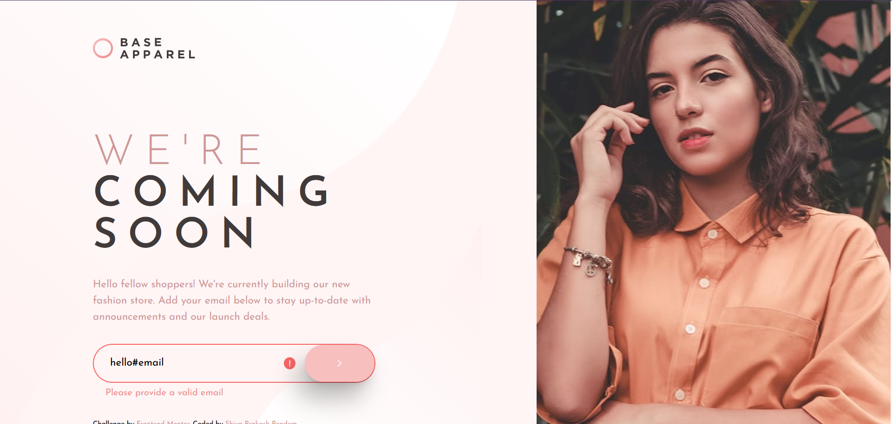

# Frontend Mentor - Base Apparel coming soon page solution

This is a solution to the [Base Apparel coming soon page challenge on Frontend Mentor](https://www.frontendmentor.io/challenges/base-apparel-coming-soon-page-5d46b47f8db8a7063f9331a0). Frontend Mentor challenges help you improve your coding skills by building realistic projects.

## Table of contents

- [Overview](#overview)
  - [The challenge](#the-challenge)
  - [Screenshots](#screenshots)
  - [Links](#links)
- [My process](#my-process)
  - [Built with](#built-with)
  - [Useful resources](#useful-resources)
- [Author](#author)

## Overview

### The challenge

Users should be able to:

- View the optimal layout for the site depending on their device's screen size
- See hover states for all interactive elements on the page
- Receive an error message when the `form` is submitted if:
  - The `input` field is empty
  - The email address is not formatted correctly

### Screenshots

#### Desktop Views

##### Error and Button Hover view

#### Mobile View

### Links

- Solution URL: [GitHub repo](https://github.com/shivaprakash-sudo/base-apparel-coming-soon)
- Live Site URL: [Base Apparel Coming Soon](https://shivaprakash-sudo.github.io/base-apparel-coming-soon/)

## My process

### Built with

- Semantic HTML5 markup
- Flexbox
- CSS Grid
- Mobile-first workflow
- Tailwindcss - For styles

### Useful resources

- [Tailwindcss](https://tailwindcss.com/docs/installation) - Official documentation is always a good place to start when you're in doubt.

## Author

- Frontend Mentor - [@shivaprakash-sudo](https://www.frontendmentor.io/profile/shivaprakash-sudo)
